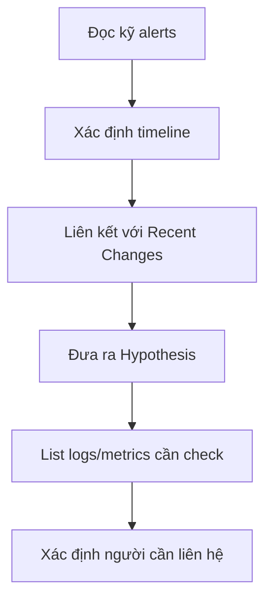
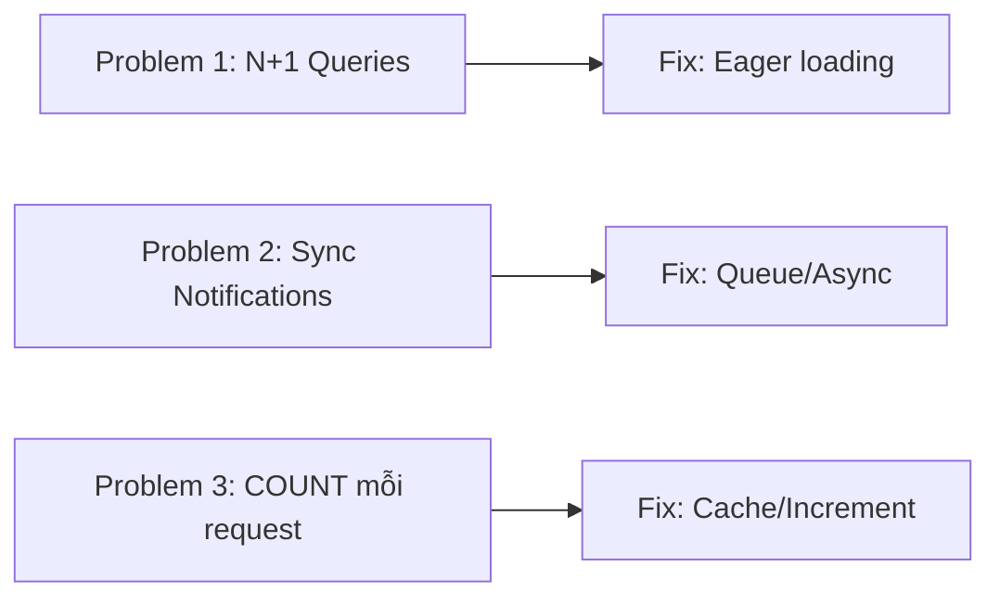
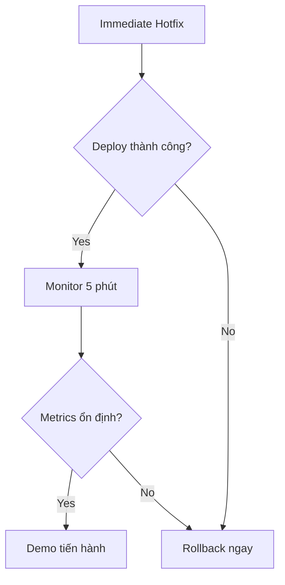
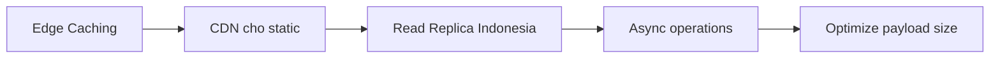
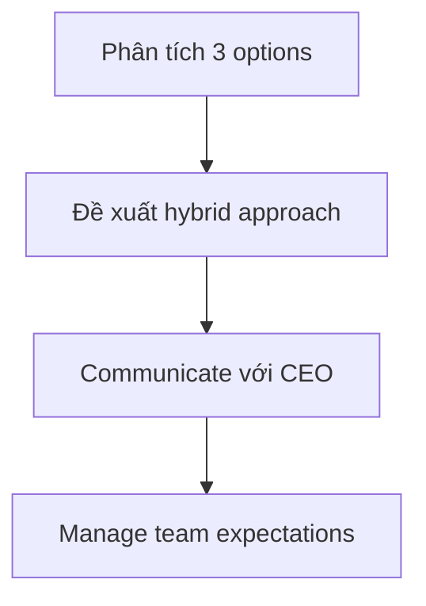

# 📋 Hướng Dẫn Trả Lời - LittleLives Interview

## 🎯 Mindset Trước Khi Bắt Đầu

```
┌─────────────────────────────────────────────────────────────┐
│  Họ đánh giá: TƯ DUY + COMMUNICATION, không phải perfect code │
│  Focus: Practical > Perfect | Business-aware | Clear reasoning │
└─────────────────────────────────────────────────────────────┘
```

---

## Phần 1.1: Immediate Diagnosis (15 phút)

### Flow Trả Lời



### 📝 Template Trả Lời

#### 1. First Hypothesis (Root Cause)

```
"Dựa trên timeline, tôi nghi ngờ [X] là root cause vì:
- Attendance feature deploy hôm qua → timing trùng khớp
- DB connections 95/100 → có thể N+1 query problem
- Response time 15s → query không efficient"
```

**Gợi ý hypothesis:**

> The new attendance feature có thể đang gây ra **N+1 query problem** hoặc **blocking synchronous operations** (real-time notifications) trong request cycle, dẫn đến:
>
> - Connection pool exhaustion
> - High response time
> - Error rate tăng do timeout

#### 2. 5 Logs/Metrics Cần Check

| #   | Log/Metric                            | Lý do                            |
| --- | ------------------------------------- | -------------------------------- |
| 1   | **Slow query logs**                   | Xác định query nào chậm          |
| 2   | **APM traces** (New Relic/Datadog)    | Xem breakdown time trong request |
| 3   | **Error logs** của attendance service | Lỗi cụ thể là gì                 |
| 4   | **Database connection pool metrics**  | Confirm connection exhaustion    |
| 5   | **Notification service logs**         | Check nếu blocking request       |

#### 3. Team Member Đầu Tiên

```
"Tôi sẽ gọi [DBA/Backend lead đã deploy feature] vì:
- Họ hiểu rõ thay đổi gần đây nhất
- Có thể confirm hoặc loại trừ hypothesis nhanh
- Có access để rollback nếu cần"
```

---

## Phần 1.2: Code Analysis (20 phút)

### 3 Performance Problems & Fixes



### 📝 Problem 1: N+1 Queries

**Vấn đề:**

```php
// Mỗi request có 6+ queries
$child = $this->Child->findById($childId);           // Query 1
$school = $this->School->findById(...);               // Query 2
$this->Attendance->save(...);                         // Query 3
$parents = $this->Parent->findByChildId($childId);   // Query 4
// foreach notification                               // Query 5, 6, 7...
$todayAttendance = $this->Attendance->find('count'...); // Query N
```

**Fix:**

```php
// Eager load với 1 query
$child = $this->Child->findById($childId, [
    'contain' => ['School', 'Parent']
]);

// Hoặc dùng JOIN
$data = $this->Child->find('first', [
    'conditions' => ['Child.id' => $childId],
    'joins' => [...],
    'fields' => [...]
]);
```

### 📝 Problem 2: Synchronous Notifications

**Vấn đề:**

```php
// Blocking trong request cycle
foreach($parents as $parent) {
    $this->NotificationService->sendRealTime(...); // ⚠️ SLOW!
}
```

**Fix:**

```php
// Dispatch to queue (async)
$this->dispatch(new SendAttendanceNotificationJob([
    'child_id' => $childId,
    'parents' => $parentIds,
    'status' => $status
]));

// Hoặc batch notifications
$this->NotificationService->sendBatch($notifications);
```

### 📝 Problem 3: COUNT Query Mỗi Request

**Vấn đề:**

```php
// Expensive COUNT cho mỗi check-in
$todayAttendance = $this->Attendance->find('count', [
    'conditions' => [
        'DATE(Attendance.timestamp)' => date('Y-m-d') // Full table scan
    ]
]);
```

**Fix:**

```php
// Option 1: Increment counter (không query)
$this->School->increment('today_attendance_count');

// Option 2: Cache với TTL
$cacheKey = "school:{$schoolId}:attendance:" . date('Y-m-d');
$count = Cache::increment($cacheKey);

// Option 3: Background job cập nhật stats
$this->dispatch(new UpdateSchoolStatsJob($schoolId));
```

### 📝 Improved Code (Full)

```php
public function markAttendance($childId, $status) {
    // 1. Single query với eager loading
    $child = $this->Child->find('first', [
        'conditions' => ['Child.id' => $childId],
        'contain' => ['School', 'Parent']
    ]);

    if (!$child) {
        throw new NotFoundException('Child not found');
    }

    // 2. Save attendance (1 query)
    $attendance = $this->Attendance->save([
        'child_id' => $childId,
        'school_id' => $child['School']['id'], // Denormalize
        'status' => $status,
        'timestamp' => date('Y-m-d H:i:s'),
        'marked_by' => $this->Auth->user('id')
    ]);

    // 3. Async notifications (không block request)
    $this->dispatch(new SendAttendanceNotificationsJob([
        'child' => $child,
        'status' => $status,
        'parents' => $child['Parent']
    ]));

    // 4. Async stats update (không block request)
    $this->dispatch(new UpdateSchoolStatsJob($child['School']['id']));

    return $this->redirect('/attendance/success');
}
```

---

## Phần 1.3: Quick Fix Strategy (10 phút)

### Flow Trả Lời



### 📝 Template Trả Lời

#### 1. Immediate Hotfix (Deploy ngay)

```
Option A (Nhanh nhất - 5 phút):
- Feature flag OFF cho attendance notifications
- Hoặc comment out notification loop tạm thời
- Stats update → move to cron job

Option B (10-15 phút):
- Wrap notifications trong try-catch với timeout 2s
- Add queue cho notifications (nếu infrastructure sẵn có)
```

**Code hotfix:**

```php
// Quick fix: Disable notifications temporarily
if (Configure::read('Feature.attendance_notifications')) {
    // Move to background
    $this->dispatch(new SendNotificationJob(...));
}

// Disable expensive stats update
// $this->updateSchoolStats(); // DISABLED FOR NOW
```

#### 2. Traffic Routing Strategy

```
1. Route Indonesian traffic → separate server/region (nếu có)
2. Rate limiting cho attendance endpoint
3. Tạm thời cache heavy queries
4. Scale up DB read replicas (nếu có)
```

#### 3. Rollback Plan

```
Timeline:
- T+0: Deploy hotfix
- T+5: Check metrics
- T+10: Nếu không cải thiện → git revert
- T+15: Verify rollback success
- T+20: Stable cho demo

Rollback command:
git revert HEAD
Deploy previous version từ CI/CD
```

---

## Phần 2.1: Technical Risk Assessment (15 phút)

### 📝 Template Xếp Hạng

| Rank  | Risk                             | Reasoning                                                           |
| ----- | -------------------------------- | ------------------------------------------------------------------- |
| **1** | Cross-region latency (Indonesia) | Trực tiếp ảnh hưởng user experience, khó fix nhanh                  |
| **2** | Database bottleneck              | 10x queries là realistic concern, cần planning                      |
| **3** | PHP memory limits                | Có thể horizontal scale nhưng cần monitoring                        |
| **4** | Mobile app crash                 | Có thể control bằng rate limiting                                   |
| **5** | AWS costs                        | Quan trọng nhưng là business decision, không phải technical blocker |

### 📝 Mitigation Strategy cho #1 (Latency)



**Chi tiết:**

```
1. Short-term (1-2 tuần):
   - CDN cho static assets (CloudFront endpoint Indonesia)
   - Giảm payload size trong API responses
   - Cache frequently accessed data

2. Medium-term (1-2 tháng):
   - Read replica trong Indonesia region
   - Edge functions cho simple operations

3. Long-term:
   - Multi-region deployment
   - Data locality compliance
```

---

## Phần 2.2: Team Resource Dilemma (15 phút)

### 📝 Recommendation Structure



### 📝 My Recommendation

```
PRIORITY ORDER:
1. Option C (Monitoring) - 1 tuần, 2 người
   → Invest trước để phát hiện vấn đề sớm

2. Option A (Performance) - 2 tuần, phần còn lại của team
   → Không thể scale nếu performance issues chưa fix

3. Option B (Localization) - Delay 1 tuần, sau đó overlap
   → Có thể bắt đầu song song khi performance ổn định

TIMELINE THỰC TẾ:
- Week 1: C (2 người) + A preparation (2 người)
- Week 2-3: A (full team) + B starts (4 người)
- Week 4: B continues + A verification
```

### 📝 Communicate với CEO

```
"Tôi hiểu urgency của việc onboard 500 trường.
Đề xuất của tôi:

1. KHÔNG thể ship cả 3 trong 2 tuần với quality đảm bảo
2. TRADE-OFF: Rushing sẽ tạo technical debt, có thể gây outage khi scale

PROPOSAL:
- Tuần 1-2: Monitoring + Performance (foundation)
- Tuần 3-4: Localization (features)
- Kết quả: Stable, scalable platform cho Q3

Nếu cần đẩy nhanh hơn, options:
- Hire contractors cho localization
- Simplify scope của localization phase 1
- Hoãn một số nice-to-have features"
```

### 📝 Nói với Team Members Bị Delay

```
"Tôi biết localization là priority của team.
Lý do delay:
- Performance issues đang ảnh hưởng production
- Không có platform ổn định → features cũng không hoạt động

Commitment:
- Localization sẽ bắt đầu ngay sau Week 1
- Tôi sẽ advocate cho resources cần thiết
- Transparency: Update hàng ngày về progress

Hỏi: Có concerns gì khác tôi cần biết không?"
```

---

## Phần 3: Video Script Outline

### Structure (10-15 phút)

```
0:00-0:30  - Intro + Context
0:30-3:00  - Problem Diagnosis (walk through hypothesis)
3:00-6:00  - Code Analysis + Fixes (share screen, explain)
6:00-8:00  - Quick Fix Strategy
8:00-10:00 - Risk Assessment + Prioritization
10:00-12:00 - Leadership: Team management approach
12:00-14:00 - Why LittleLives + Closing
```

### 🎬 Key Points Mỗi Section

**Opening:**

> "Hi, I'm [Name]. I'll walk you through my approach to this technical challenge, focusing on both the technical solutions and the leadership decisions..."

**Technical (code sharing):**

> "Let me share my screen and walk through the code. The main issues I identified are... [show fixes side by side]"

**Leadership:**

> "For the prioritization dilemma, my approach is to... [show reasoning]"

**Closing:**

> "What excites me about LittleLives is [specific thing]. My vision for V1 would be to... Thank you for considering me."

---

## ⏱️ Time Management

| Phần  | Thời gian | Focus                            |
| ----- | --------- | -------------------------------- |
| 1.1   | 15 phút   | Hypothesis + systematic approach |
| 1.2   | 20 phút   | Code fixes + comments            |
| 1.3   | 10 phút   | Practical hotfix strategy        |
| 2.1   | 15 phút   | Risk ranking + mitigation        |
| 2.2   | 15 phút   | Priority + communication         |
| Video | 15 phút   | Practice 2x trước khi record     |

---

## 🚀 Final Checklist

- [ ] Hypothesis có reasoning rõ ràng
- [ ] Code fixes có comments giải thích WHY
- [ ] Quick fix realistic (không over-engineer)
- [ ] Risk ranking có business context
- [ ] CEO communication diplomatic nhưng firm
- [ ] Team communication empathetic
- [ ] Video practice ít nhất 1 lần
- [ ] Mention AI usage honestly
- [ ] Proofread document trước submit
